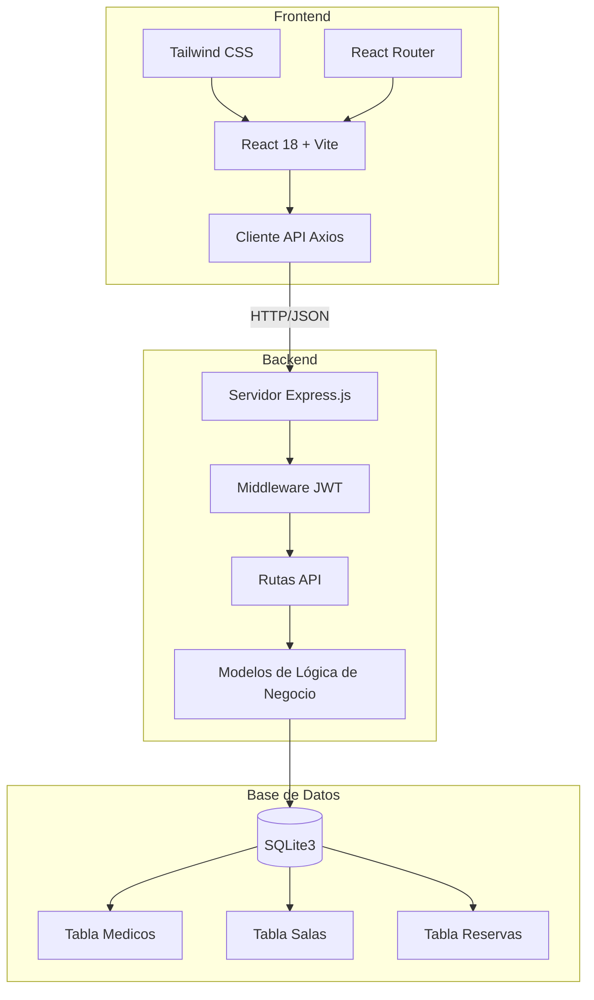
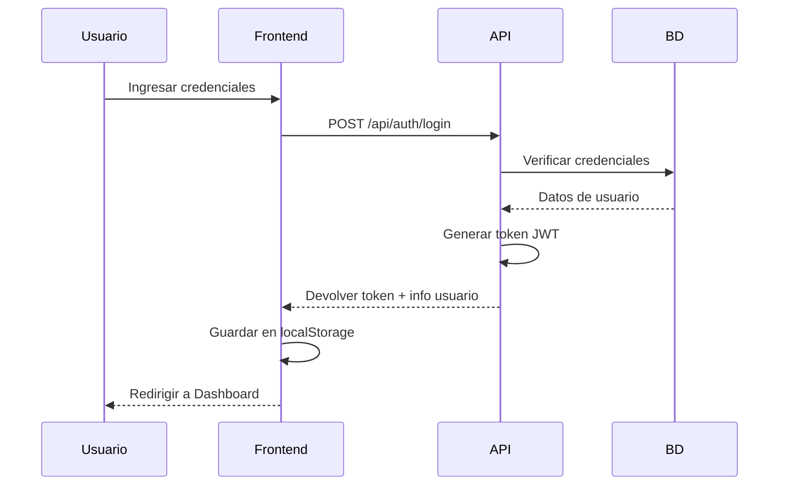
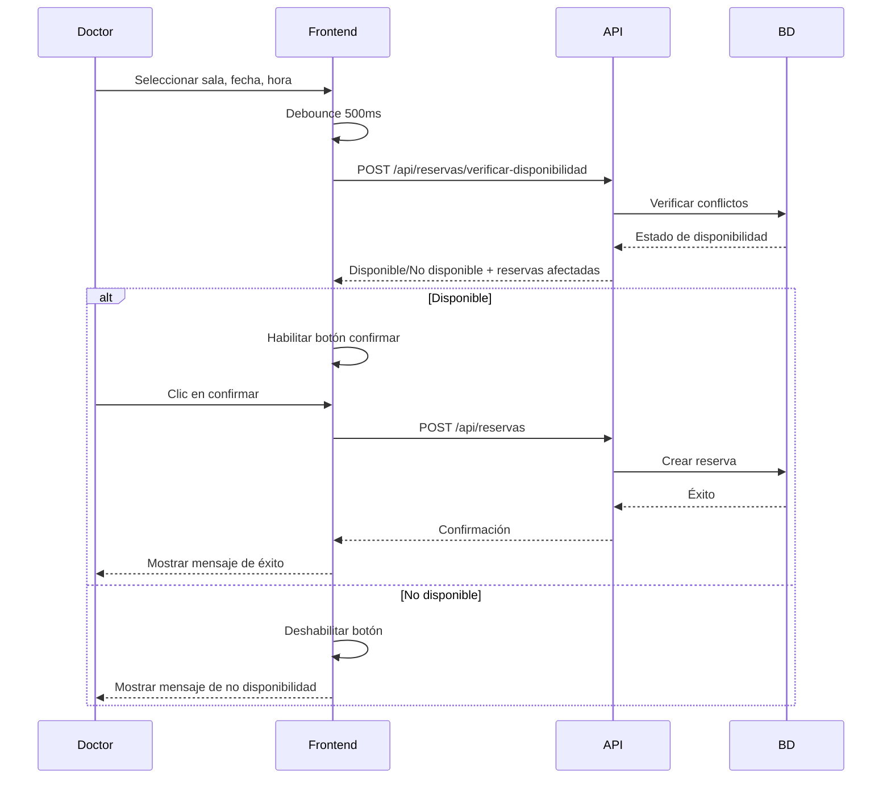
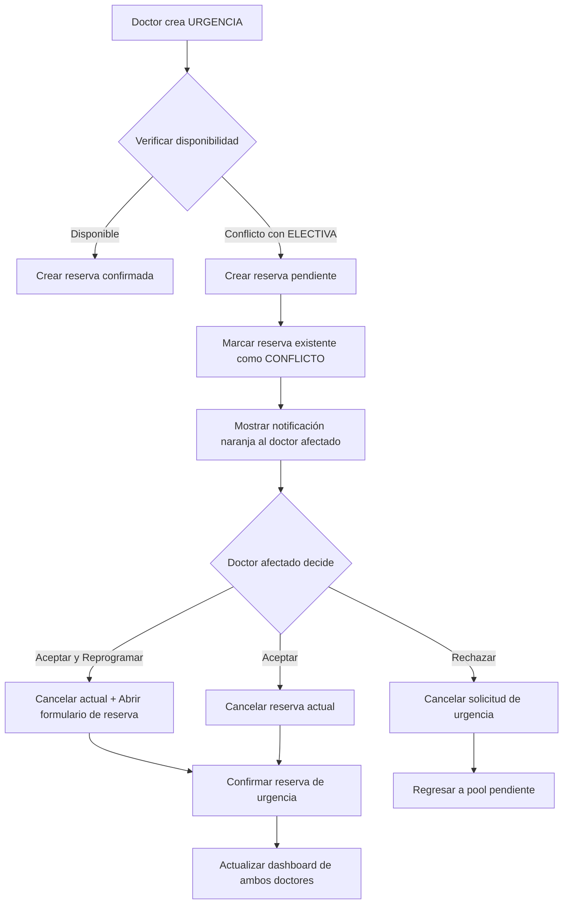
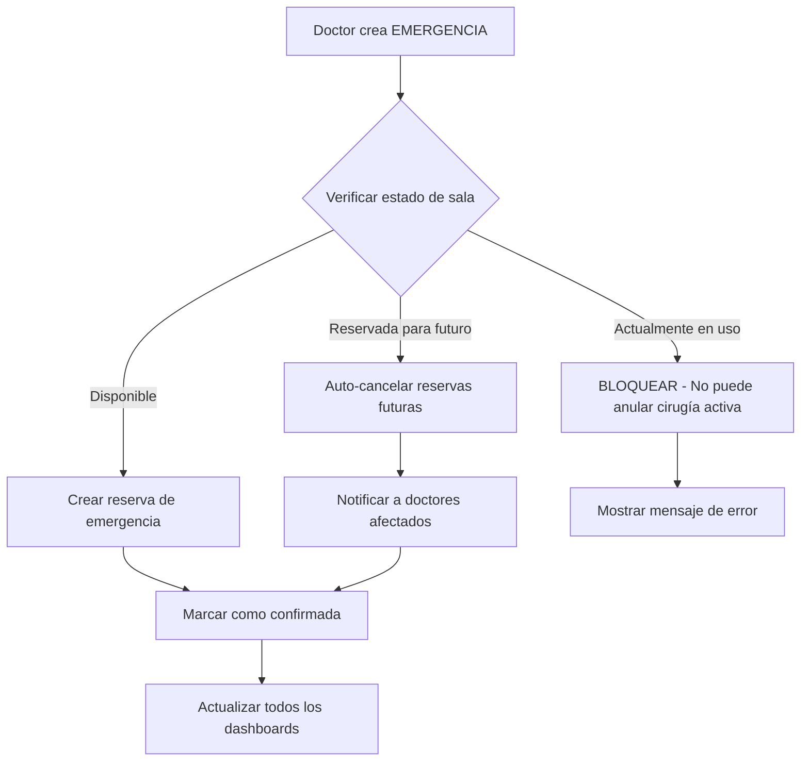
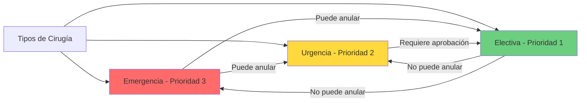
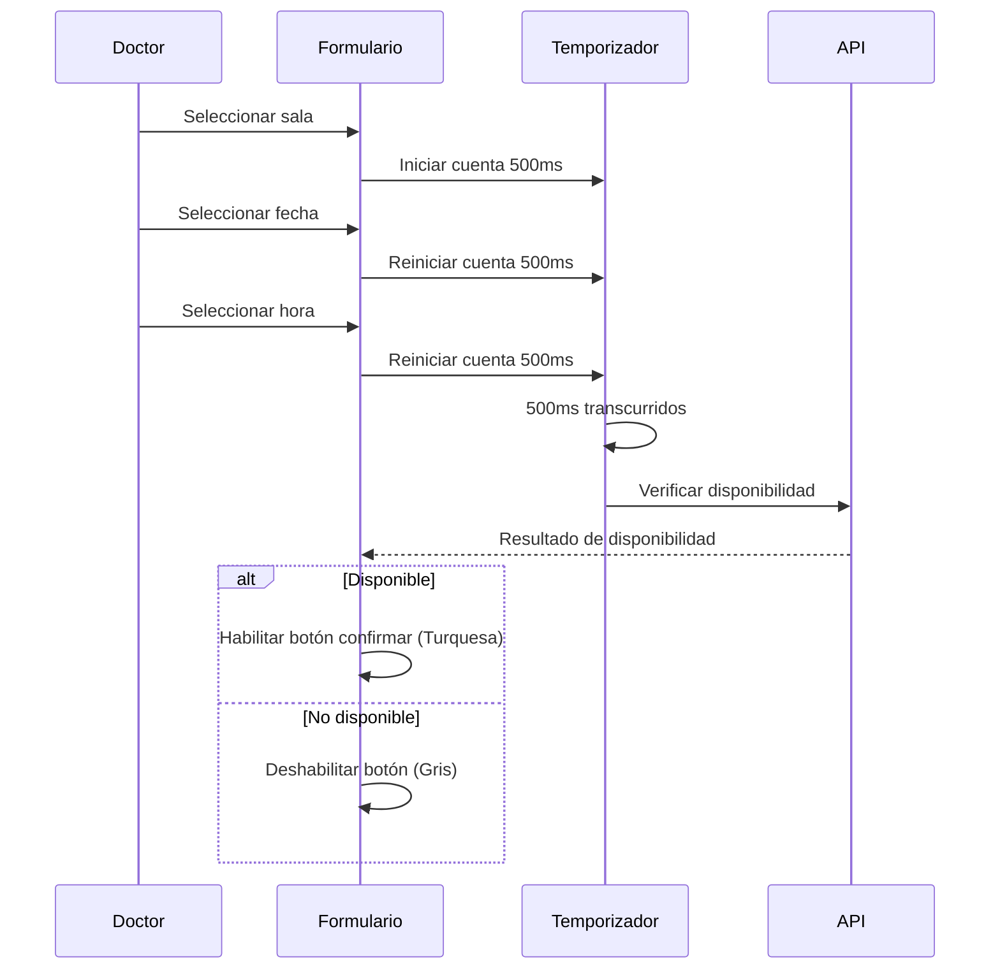
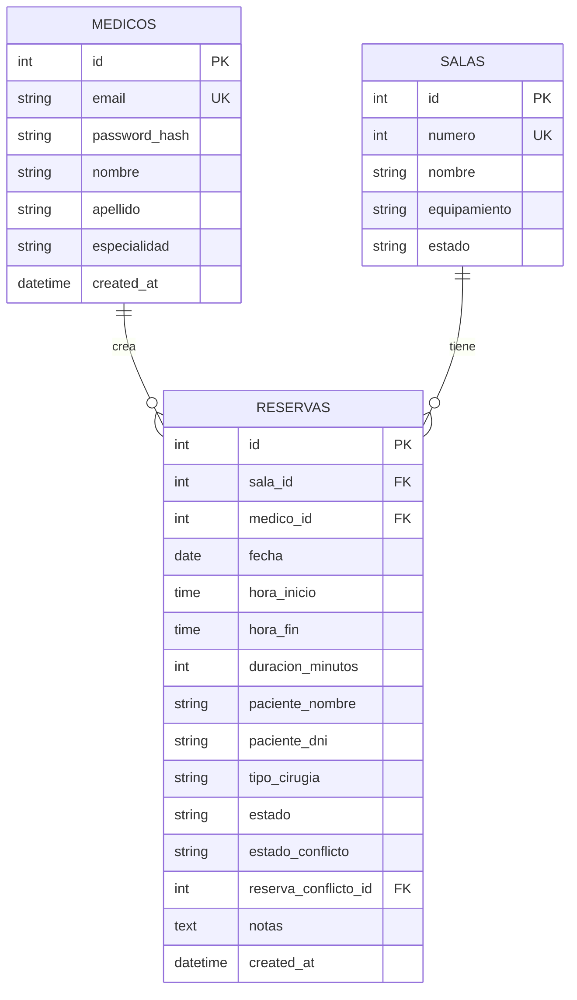

# SQIO - Características y Documentación de Procesos

## 📋 Tabla de Contenidos
- [Características Principales](#características-principales)
- [Arquitectura del Sistema](#arquitectura-del-sistema)
- [Flujos de Procesos](#flujos-de-procesos)
- [Endpoints de la API](#endpoints-de-la-api)
- [Esquema de Base de Datos](#esquema-de-base-de-datos)

## ✨ Características Principales

### 1. Sistema de Autenticación
- **Autenticación basada en JWT** con gestión segura de tokens
- **Encriptación de contraseñas** usando bcryptjs (10 salt rounds)
- **Rutas protegidas** con validación mediante middleware
- **Persistencia de sesión** vía localStorage
- **Actualización automática de tokens** al recargar la página

### 2. Gestión de Quirófanos
- **Estado en tiempo real** de las salas (Disponible, Ocupada, Reservada)
- **Soporte multi-sala** con configuraciones personalizables
- **Seguimiento de equipamiento** específico por sala
- **Verificación de disponibilidad** antes de reservar
- **Indicadores visuales de estado** con código de colores

### 3. Sistema de Reservas
- **Programación basada en prioridades** (Emergencia > Urgencia > Electiva)
- **Verificación de disponibilidad en tiempo real** con debounce de 500ms
- **Cálculo automático de tiempo** para la duración de cirugía
- **Captura de información del paciente** (nombre, DNI)
- **Clasificación de tipo de cirugía** (Emergencia, Urgencia, Electiva)
- **Cancelación de reservas** por el médico propietario
- **Prevención de fechas/horas pasadas** mediante validación

### 4. Sistema de Resolución de Conflictos
- **Detección automática de conflictos** cuando urgencias se superponen con electivas
- **Notificaciones visuales de conflicto** con indicadores naranjas
- **Tres opciones de resolución:**
  - Aceptar y Reprogramar (cancelar + crear nueva reserva)
  - Aceptar (cancelar reserva actual)
  - Rechazar (denegar la solicitud de urgencia)
- **Seguimiento de estado pendiente** para solicitudes de urgencia
- **Indicadores azules** para confirmaciones pendientes
- **Auto-cancelación de emergencias** solo para reservas futuras

### 5. Características del Dashboard
- **Vista de reservas de hoy** para el médico autenticado
- **Gestión de agenda personal**
- **Tipos de cirugía codificados por color:**
  - Rojo: Emergencia
  - Amarillo: Urgencia
  - Turquesa: Electiva
  - Naranja: Conflicto
  - Azul: Pendiente
- **Botones de acción rápida** para gestión de reservas
- **Diseño responsivo** para móvil y escritorio

### 6. Interfaz de Usuario
- **Tema turquesa hospitalario** en toda la aplicación
- **Diseño responsivo** con Tailwind CSS
- **Estados de carga** con spinners
- **Manejo de errores** con mensajes claros
- **Retroalimentación de éxito** con confirmaciones
- **Iconos Lucide** para claridad visual

## 🏗️ Arquitectura del Sistema

## 🔄 Flujos de Procesos

### Flujo de Autenticación

### Flujo de Creación de Reserva

### Flujo de Resolución de Conflictos (Urgencia)

### Flujo de Anulación por Emergencia

### Sistema de Prioridades

### Flujo de Validación en Tiempo Real

## 🔌 Endpoints de la API

### Autenticación
| Método | Endpoint | Descripción | Requiere Auth |
|--------|----------|-------------|---------------|
| POST | `/api/auth/login` | Login con email/contraseña | ❌ |
| POST | `/api/auth/register` | Registrar nuevo médico | ❌ |

### Quirófanos
| Método | Endpoint | Descripción | Requiere Auth |
|--------|----------|-------------|---------------|
| GET | `/api/salas` | Obtener todos los quirófanos | ✅ |

### Reservas
| Método | Endpoint | Descripción | Requiere Auth |
|--------|----------|-------------|---------------|
| GET | `/api/reservas` | Obtener reservas (con filtros) | ✅ |
| POST | `/api/reservas` | Crear nueva reserva | ✅ |
| POST | `/api/reservas/verificar-disponibilidad` | Verificar disponibilidad | ✅ |
| POST | `/api/reservas/:id/cancelar` | Cancelar reserva | ✅ |
| POST | `/api/reservas/:id/aceptar-conflicto` | Aceptar conflicto (cancelar propia) | ✅ |
| POST | `/api/reservas/:id/rechazar-conflicto` | Rechazar conflicto | ✅ |

### Parámetros de Consulta
- `fecha` - Filtrar por fecha (YYYY-MM-DD)
- `sala_id` - Filtrar por ID de sala
- `medico_id` - Filtrar por ID de médico

## 🗄️ Esquema de Base de Datos

### Detalles de las Tablas

#### `medicos`
- Almacena información de doctores
- Contraseñas hasheadas con bcryptjs
- Email es identificador único

#### `salas`
- Configuraciones de quirófanos
- Especificaciones de equipamiento
- Estado de sala (disponible, mantenimiento, etc.)

#### `reservas`
- Reservas de cirugías
- **Niveles de prioridad:**
  - `emergencia` (3): Prioridad más alta
  - `urgencia` (2): Prioridad media
  - `electiva` (1): Prioridad más baja
- **Tipos de estado:**
  - `confirmada`: Reserva activa
  - `cancelada`: Cancelada
  - `pendiente_confirmacion`: Urgencia esperando aprobación
- **Campos de conflicto:**
  - `estado_conflicto`: `requiere_decision` o `pendiente_aprobacion`
  - `reserva_conflicto_id`: Enlaza con reserva en conflicto

## 🔐 Características de Seguridad

1. **Seguridad de Contraseñas**
   - Hashing con Bcrypt y 10 salt rounds
   - Nunca almacenadas en texto plano
   - Comparación segura durante el login

2. **Tokens JWT**
   - Firmados con clave secreta
   - Incluye ID y email del médico
   - Sin expiración para MVP (agregar en producción)

3. **Rutas Protegidas**
   - Middleware valida JWT en cada petición
   - Acceso no autorizado retorna 401
   - Token enviado vía header Authorization

4. **Validación de Entrada**
   - Validación de formato de email
   - Validación de fecha/hora (sin reservas pasadas)
   - Verificación de campos requeridos
   - Prevención de inyección SQL vía consultas parametrizadas

5. **Configuración CORS**
   - Desarrollo: Permisivo para localhost
   - Producción: Restringido a dominio específico

## 📱 Diseño Responsivo

- **Breakpoints móviles** con Tailwind CSS
- **Navegación colapsable** en pantallas pequeñas
- **Botones táctiles** con espaciado adecuado
- **Texto legible** en todos los tamaños de dispositivo
- **Layouts de grilla** se adaptan al ancho de pantalla

## 🎨 Sistema de Colores

| Estado | Color | Hex |
|--------|-------|-----|
| Disponible | Verde | `#10b981` |
| Ocupada | Rojo | `#ef4444` |
| Reservada | Amarillo | `#f59e0b` |
| Conflicto | Naranja | `#f97316` |
| Pendiente | Azul | `#3b82f6` |
| Primario (Turquesa) | Turquesa | `#14b8a6` |
| Emergencia | Rojo | `#dc2626` |
| Urgencia | Amarillo | `#eab308` |
| Electiva | Turquesa | `#14b8a6` |

## 🚀 Mejoras Futuras (Características Premium)

- **Vista de Calendario** - Calendario visual mensual (ya implementado, actualmente oculto)
- **Notificaciones por Email** - Alertas automáticas de conflictos
- **Notificaciones Push** - Actualizaciones en tiempo real
- **Dashboard de Reportes** - Analíticas y estadísticas
- **Soporte Multi-instalación** - Múltiples hospitales/clínicas
- **Acceso Basado en Roles** - Roles de Admin, Doctor, Enfermera
- **Logs de Auditoría** - Seguimiento de todos los cambios del sistema
- **Funcionalidad de Exportación** - Reportes en PDF/Excel

---

**Última Actualización:** 28 de Noviembre de 2025
**Versión:** 1.0.0 MVP
