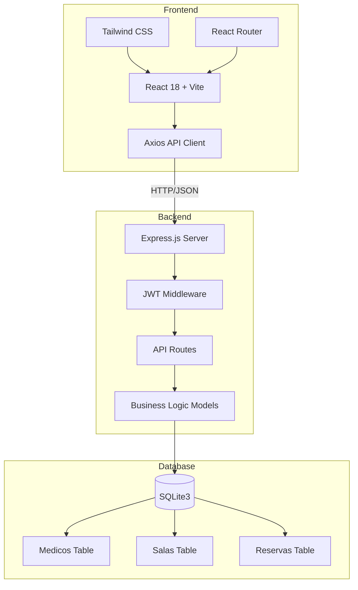
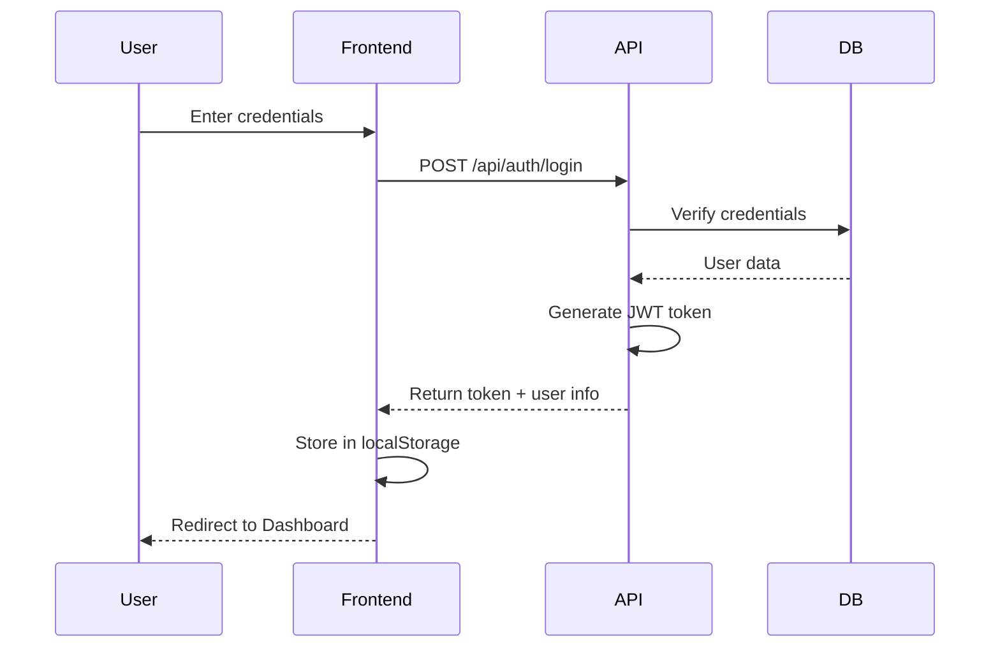
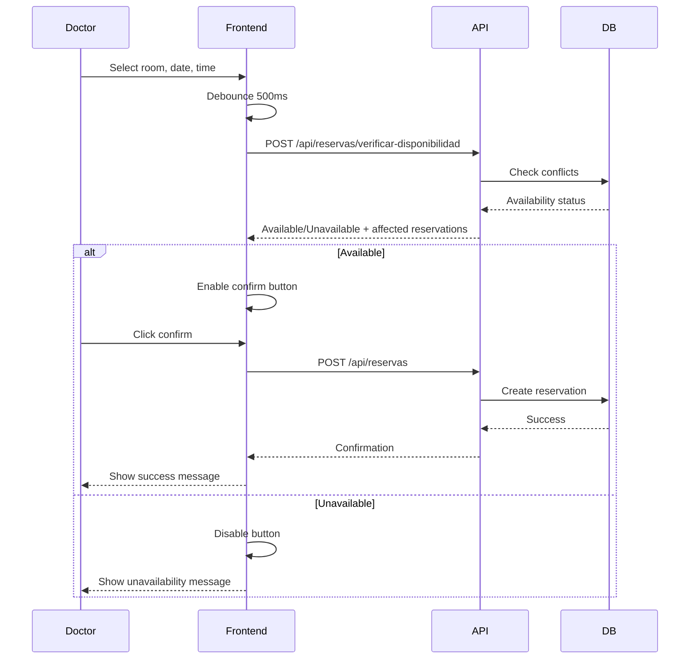
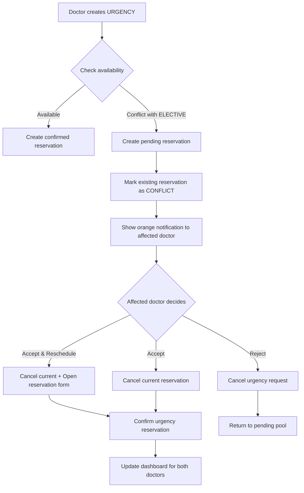
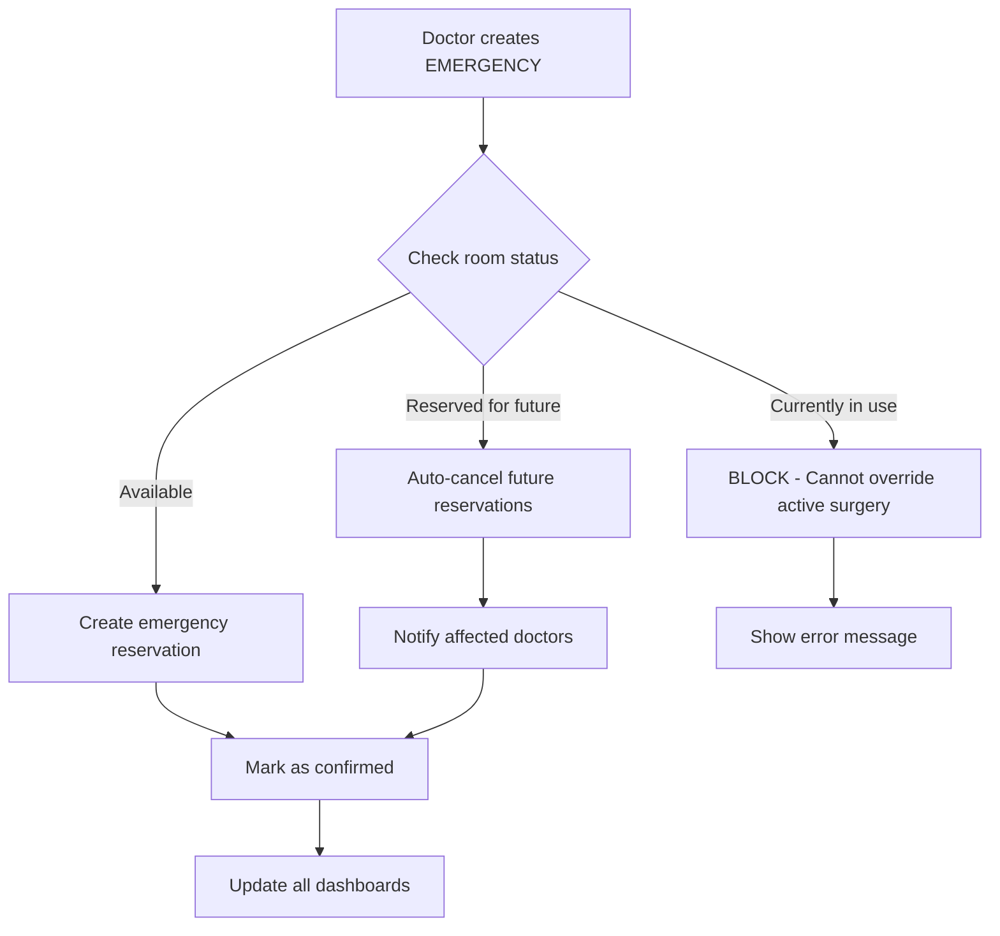
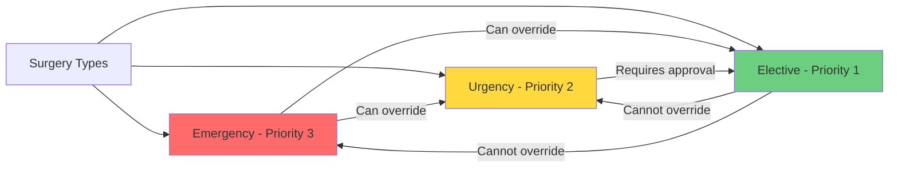
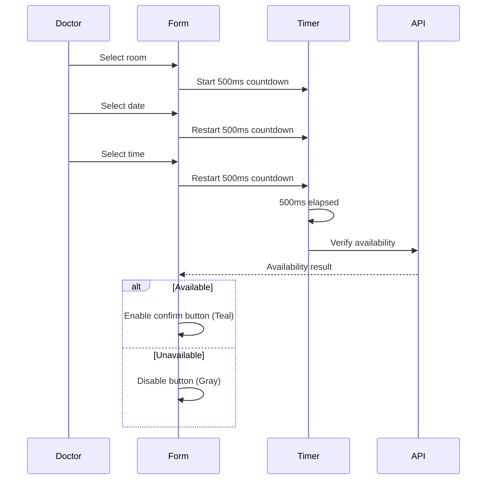
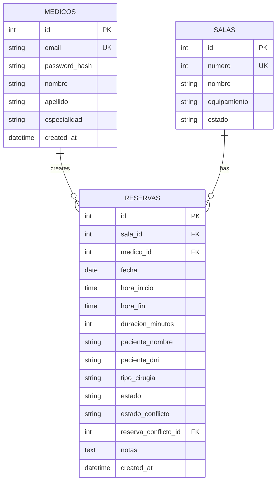

# SQIO - Features & Process Documentation

## 📋 Table of Contents
- [Core Features](#core-features)
- [System Architecture](#system-architecture)
- [Process Flows](#process-flows)
- [API Endpoints](#api-endpoints)
- [Database Schema](#database-schema)

## ✨ Core Features

### 1. Authentication System
- **JWT-based authentication** with secure token management
- **Password encryption** using bcryptjs (10 salt rounds)
- **Protected routes** with middleware validation
- **Session persistence** via localStorage
- **Automatic token refresh** on page reload

### 2. Operating Room Management
- **Real-time room status** display (Available, Occupied, Reserved)
- **Multi-room support** with customizable configurations
- **Room-specific equipment** tracking
- **Availability verification** before booking
- **Visual status indicators** with color coding

### 3. Reservation System
- **Priority-based scheduling** (Emergency > Urgency > Elective)
- **Real-time availability checking** with 500ms debounce
- **Automatic time calculation** for surgery duration
- **Patient information** capture (name, DNI)
- **Surgery type classification** (Emergency, Urgency, Elective)
- **Reservation cancellation** by the owning doctor
- **Past date/time prevention** validation

### 4. Conflict Resolution System
- **Automatic conflict detection** when urgencies overlap with electives
- **Visual conflict notifications** with orange indicators
- **Three-resolution options:**
  - Accept & Reschedule (cancel + create new reservation)
  - Accept (cancel current reservation)
  - Reject (deny the urgency request)
- **Pending status tracking** for urgency requests
- **Blue indicators** for pending confirmations
- **Emergency auto-cancellation** for future reservations only

### 5. Dashboard Features
- **Today's reservations** view for logged-in doctor
- **Personal schedule** management
- **Color-coded surgery types:**
  - Red: Emergency
  - Yellow: Urgency
  - Teal: Elective
  - Orange: Conflict
  - Blue: Pending
- **Quick action buttons** for reservation management
- **Responsive layout** for mobile and desktop

### 6. User Interface
- **Teal hospital theme** throughout the application
- **Responsive design** with Tailwind CSS
- **Loading states** with spinners
- **Error handling** with clear messages
- **Success feedback** with confirmations
- **Lucide icons** for visual clarity

## 🏗️ System Architecture

## 🔄 Process Flows

### Authentication Flow

### Reservation Creation Flow

### Conflict Resolution Flow (Urgency)

### Emergency Override Flow

### Priority System

### Real-time Validation Flow

## 🔌 API Endpoints

### Authentication
| Method | Endpoint | Description | Auth Required |
|--------|----------|-------------|---------------|
| POST | `/api/auth/login` | Login with email/password | ❌ |
| POST | `/api/auth/register` | Register new doctor | ❌ |

### Operating Rooms
| Method | Endpoint | Description | Auth Required |
|--------|----------|-------------|---------------|
| GET | `/api/salas` | Get all operating rooms | ✅ |

### Reservations
| Method | Endpoint | Description | Auth Required |
|--------|----------|-------------|---------------|
| GET | `/api/reservas` | Get reservations (with filters) | ✅ |
| POST | `/api/reservas` | Create new reservation | ✅ |
| POST | `/api/reservas/verificar-disponibilidad` | Check availability | ✅ |
| POST | `/api/reservas/:id/cancelar` | Cancel reservation | ✅ |
| POST | `/api/reservas/:id/aceptar-conflicto` | Accept conflict (cancel own) | ✅ |
| POST | `/api/reservas/:id/rechazar-conflicto` | Reject conflict | ✅ |

### Query Parameters
- `fecha` - Filter by date (YYYY-MM-DD)
- `sala_id` - Filter by room ID
- `medico_id` - Filter by doctor ID

## 🗄️ Database Schema

### Table Details

#### `medicos`
- Stores doctor information
- Passwords hashed with bcryptjs
- Email is unique identifier

#### `salas`
- Operating room configurations
- Equipment specifications
- Room status (disponible, mantenimiento, etc.)

#### `reservas`
- Surgery reservations
- **Priority levels:**
  - `emergencia` (3): Highest priority
  - `urgencia` (2): Medium priority
  - `electiva` (1): Lowest priority
- **Status types:**
  - `confirmada`: Active reservation
  - `cancelada`: Cancelled
  - `pendiente_confirmacion`: Urgency waiting approval
- **Conflict fields:**
  - `estado_conflicto`: `requiere_decision` or `pendiente_aprobacion`
  - `reserva_conflicto_id`: Links to conflicting reservation

## 🔐 Security Features

1. **Password Security**
   - Bcrypt hashing with 10 salt rounds
   - Never stored in plain text
   - Secure comparison during login

2. **JWT Tokens**
   - Signed with secret key
   - Includes doctor ID and email
   - No expiration for MVP (add in production)

3. **Protected Routes**
   - Middleware validates JWT on every request
   - Unauthorized access returns 401
   - Token sent via Authorization header

4. **Input Validation**
   - Email format validation
   - Date/time validation (no past bookings)
   - Required field checks
   - SQL injection prevention via parameterized queries

5. **CORS Configuration**
   - Development: Permissive for localhost
   - Production: Restricted to specific domain

## 📱 Responsive Design

- **Mobile breakpoints** with Tailwind CSS
- **Collapsible navigation** on small screens
- **Touch-friendly buttons** with adequate spacing
- **Readable text** on all device sizes
- **Grid layouts** adapt to screen width

## 🎨 Color System

| Status | Color | Hex |
|--------|-------|-----|
| Available | Green | `#10b981` |
| Occupied | Red | `#ef4444` |
| Reserved | Yellow | `#f59e0b` |
| Conflict | Orange | `#f97316` |
| Pending | Blue | `#3b82f6` |
| Primary (Teal) | Teal | `#14b8a6` |
| Emergency | Red | `#dc2626` |
| Urgency | Yellow | `#eab308` |
| Elective | Teal | `#14b8a6` |

## 🚀 Future Enhancements (Premium Features)

- **Calendar View** - Monthly visual calendar (already implemented, currently hidden)
- **Email Notifications** - Automatic conflict alerts
- **Push Notifications** - Real-time updates
- **Reporting Dashboard** - Analytics and statistics
- **Multi-facility Support** - Multiple hospitals/clinics
- **Role-based Access** - Admin, Doctor, Nurse roles
- **Audit Logs** - Track all system changes
- **Export Functionality** - PDF/Excel reports

---

**Last Updated:** November 28, 2025
**Version:** 1.0.0 MVP
